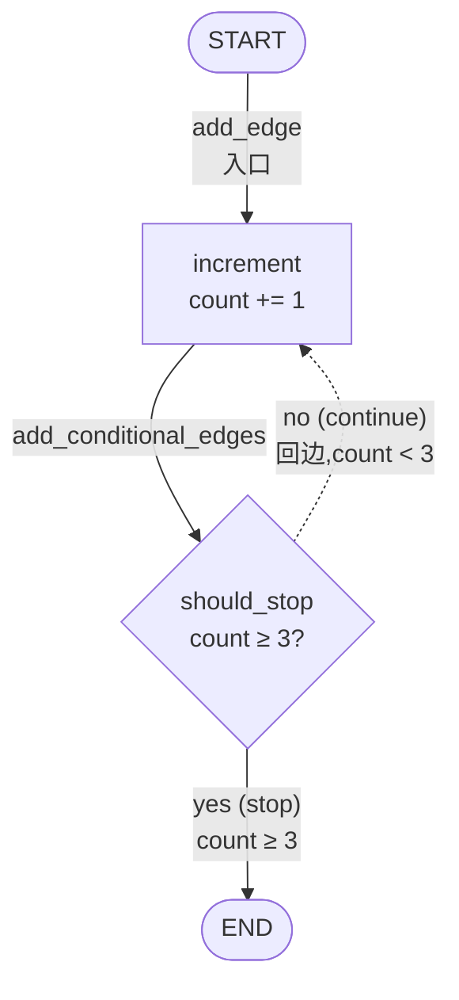
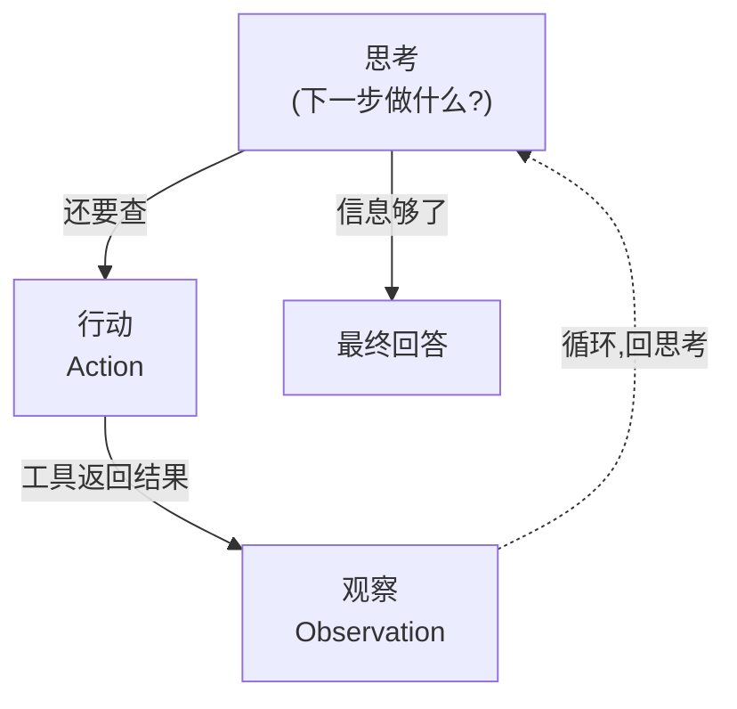
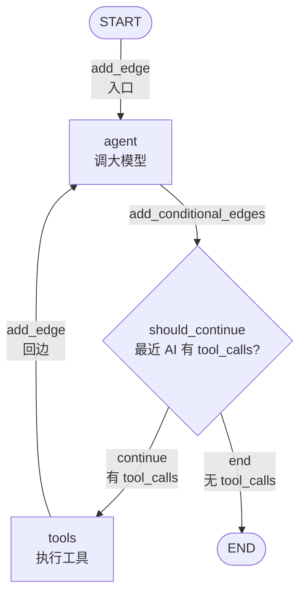
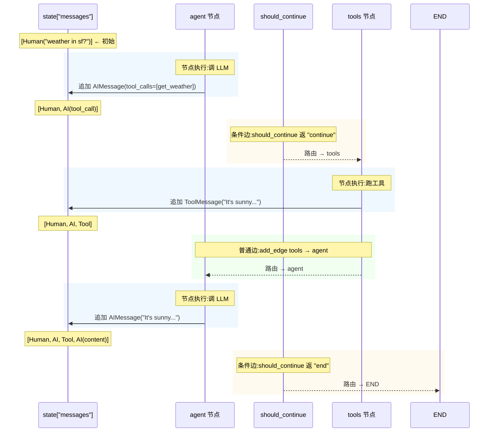

# 深度理解 LangGraph 状态机——用 LangGraph 实现 Agent 经典模式 ReAct

---

## 1. LangGraph 核心概念

### 1.0 先看个最小例子

```python
from typing_extensions import TypedDict
from langgraph.graph import StateGraph, START, END


class CountState(TypedDict):
    count: int


def increment(state: CountState) -> dict:
    return {"count": state["count"] + 1}


def should_stop(state: CountState) -> str:
    return "stop" if state["count"] >= 3 else "continue"


graph = StateGraph(CountState)
graph.add_node("increment", increment)
graph.add_edge(START, "increment")
graph.add_conditional_edges(
    "increment",
    should_stop,
    {"continue": "increment", "stop": END},
)

app = graph.compile()
print(app.invoke({"count": 0}))   # {'count': 3}
```

LangGraph 的 API解读:

- `StateGraph(CountState)` —— 一张图,全局 state 是 `CountState`
- `add_node("increment", increment)` —— 注册节点
- `add_edge(START, "increment")` —— 普通边
- `add_conditional_edges(..., should_stop, {...})` —— 条件边
- `compile()` —— 把声明式结构变成可执行对象
- `invoke(...)` —— 启动图,跑一次到结束




条件边:"stop" → END, "continue" → 回 increment 自身。

### 1.1 图的三个核心元素

```
┌───────────────────────────────────────────┐
│                                           │
│  State   →  全局上下文 / 状态机的全局变量   │
│  Node    →  处理函数 / 读 state 写回 state │
│  Edge    →  节点之间的转移规则              │
│                                           │
└───────────────────────────────────────────┘
```

LangGraph 对应到代码上,就是 `StateGraph` 类的 `add_node` / `add_edge` / 状态 schema 定义。

### 1.2 State 在节点间自动累积

节点之间传 state,要回答一个问题:**节点返回的部分 state 是覆盖还是追加?**

默认是覆盖。简单字段(比如 `count: int`)这样没问题,但 `messages: list` 就不行——每一轮 LLM 调用、工具调用都要把新消息**追加**到对话历史里。

LangGraph 用类型注解里挂一个"如何合并"的小函数来解决:

```python
from collections.abc import Sequence
from typing import Annotated
from typing_extensions import TypedDict
from langchain_core.messages import BaseMessage
from langgraph.graph.message import add_messages


class AgentState(TypedDict):
    messages: Annotated[Sequence[BaseMessage], add_messages]
```

`add_messages` 就是那个合并函数,合并规则是**追加而不是替换**:

```python
# 节点 A 返回 {"messages": [msg1, msg2]}   → state["messages"] 追加 msg1, msg2
# 节点 B 返回 {"messages": [msg3]}         → state["messages"] 追加 msg3
```

这样 ReAct 那张图才能"循环跑 N 轮,每一轮的对话历史都保留下来",下一轮 LLM 看到的是完整历史。

不挂合并函数会怎样:

```python
class AgentState(TypedDict):
    messages: list                  # ← 默认行为 = 替换

# 节点返回 {"messages": [AIMessage(content="...")]}
# state["messages"] 整个被替换为那条 AI 消息
# HumanMessage("天气?") 丢了,下一轮 LLM 不知道用户问的什么
```

### 1.3 边的两类

- **普通边** `add_edge("A", "B")` —— A 跑完一定跳 B
- **条件边** `add_conditional_edges("A", router_fn, path_map)` —— A 跑完调 `router_fn(state)`,根据返回值查 `path_map` 决定下一步

ReAct 的"要不要继续调工具"循环,天然需要条件边。

### 1.4 入口与终止

- **入口**:`START` 节点,或 `set_entry_point("agent")` 显式指定第一个节点
- **终止**:`END` 特殊标识,代表图跑完了

LangGraph 内置了 `START` 哨兵节点(不需要 `add_node("START", ...)` 注册),`compile()` 后图从它开始执行。

---

## 2. 如何用 LangGraph 实现 ReAct 模式

### 2.1 ReAct 是什么

ReAct(Reason-Action)的核心:**让大模型在思考的同时也能动手**——不是先全部想完再调工具,而是每想一步都可能动手,再根据工具返回的结果继续推理。




循环路径:思考 → 行动 → 观察 → 思考 → ...
退出路径:思考 → 最终回答

模型自己决定每一步该做什么。这种"思考 → 行动 → 观察 → 思考 → ..."循环可能跑很多次才停,也可能一轮就够。

### 2.2 用 LangGraph 中图的概念实现 ReAct

把 ReAct 翻译成 LangGraph 的图,3 个决策:

**决策 1:有几个节点?** —— 2 个。ReAct 行为里两个不同的工作:调大模型让它思考、跑工具拿到结果。

- `agent` 节点 = 调大模型
- `tools` 节点 = 执行模型声明的工具调用

**决策 2:有几条边?** —— 1 条普通边 + 1 条条件边。

- `tools` 跑完一定回到 `agent` → 普通边 `tools → agent`
- `agent` 跑完后**不一定**去 `tools`,模型觉得答完了就直接结束 → 条件边 `agent → {tools, END}`

**决策 3:条件边的路由器怎么写?** —— "是否继续"等价于:最近一条 AI 消息里有没有 `tool_calls`?

- 有 → 模型想调工具,跳 `tools`
- 没有 → 模型给出最终答案,跳 `END`

完整拓扑:




决策点放在 `agent` 之后(不是 `tools` 之后),因为"要不要继续"取决于 AI 的最新输出,不是工具结果。回边只画 `tools → agent`,反过来不会发生。

### 2.3 核心代码解读

#### 2.3.1 图装配

`build_app` 把"图怎么装起来"全说清楚:state schema、三个处理单元、Provider/checkpointer 全部串成一张可执行图。先看完整骨架,后面 §2.3.2-§2.3.4 再拆每个零件。

```python
from langgraph.checkpoint.memory import InMemorySaver
from langgraph.graph import END, StateGraph
from langgraph.graph.state import CompiledStateGraph


def build_app(model=None, tools=None, checkpointer=None) -> CompiledStateGraph:
    if tools is None:
        tools = ALL_TOOLS                                       # §2.3.3 ② 默认工具集
    if model is None:
        model = make_default_model().bind_tools(tools)          # §2.3.4 ② + ③
    checkpointer = checkpointer or InMemorySaver()

    workflow = StateGraph(AgentState)                           # §2.3.2
    workflow.add_node("agent", make_call_model(model))          # §2.3.3 ①
    workflow.add_node("tools", make_tool_node(tools))           # §2.3.3 ②

    # 入口
    workflow.set_entry_point("agent")

    # 条件边:agent 出来后路由器判下一步
    workflow.add_conditional_edges(
        "agent",
        should_continue,                                        # §2.3.3 ③
        {"continue": "tools", "end": END},
    )

    # 回边
    workflow.add_edge("tools", "agent")

    # 编译成可执行对象
    return workflow.compile(checkpointer=checkpointer)
```

`add_conditional_edges` 是**三元组**:源节点 + 路由器 + 路径映射表。`set_entry_point("agent")` 是 `add_edge(START, "agent")` 的简写。`compile(checkpointer=...)` 实例化整张图,带上 `InMemorySaver` —— 这个 checkpointer **不是摆设**,它给图配上一个"按 `thread_id` 持久化 state"的存储后端。

#### 2.3.2 状态 schema

```python
from collections.abc import Sequence
from typing import Annotated
from typing_extensions import TypedDict
from langchain_core.messages import BaseMessage
from langgraph.graph.message import add_messages


class AgentState(TypedDict):
    """ReAct 唯一的全局状态:messages 列表。"""
    messages: Annotated[Sequence[BaseMessage], add_messages]
```

`AgentState` 是图的全局 state,只有 1 个字段 `messages`,装着对话历史。每节点产生的新消息按 `add_messages` 的合并规则追加到这个列表里。

#### 2.3.3 三个处理单元

**① 大模型调用(`agent` 节点)**

```python
from langchain_core.messages import SystemMessage
from langchain_core.runnables import RunnableConfig

SYSTEM_PROMPT = SystemMessage(
    "You are a helpful AI assistant, please respond to the users query to the best of your ability!"
)


def make_call_model(model):
    """工厂:返回一个能被 LangGraph 当作节点调用的函数。"""
    def call_model(state: AgentState, config: RunnableConfig = None) -> dict:
        response = model.invoke([SYSTEM_PROMPT] + list(state["messages"]), config)
        return {"messages": [response]}   # list 包一层,因为合并函数需要列表
    return call_model
```

工厂模式是为了测试时方便换底层模型——`FakeMessagesListChatModel` 是 `langchain_core` 自带的假模型,不需要调真 API:

```python
fake_model = FakeMessagesListChatModel(responses=[...])
call_model = make_call_model(fake_model)
graph.add_node("agent", call_model)
```

直接定义 `call_model(state)` 会**硬编码**(hardcode)用哪个模型,测试得 **monkeypatch** 替换。工厂把"用什么模型"作为参数注入。

**② 工具执行(`tools` 节点)**

```python
import json
from langchain_core.messages import ToolMessage


def make_tool_node(tools):
    tools_by_name = {t.name: t for t in tools}   # 只算一次,后续节点调用复用

    def tool_node(state: AgentState) -> dict:
        outputs = []
        # 取最新那条 AI 消息里的所有 tool_calls,逐个执行
        for tool_call in state["messages"][-1].tool_calls:
            tool_result = tools_by_name[tool_call["name"]].invoke(tool_call["args"])
            outputs.append(
                ToolMessage(
                    content=json.dumps(tool_result),
                    name=tool_call["name"],
                    tool_call_id=tool_call["id"],   # 必须跟 AI 消息的 id 配对
                )
            )
        return {"messages": outputs}

    return tool_node
```

`state["messages"][-1].tool_calls` —— 只读最新那条 AI 消息里的 tool_calls。LLM 一次能 emit 多个 tool_call,逐个跑。

`tool_call_id=tool_call["id"]` —— 协议强约束。每条 ToolMessage 必须带 `tool_call_id` 跟产生它的 AI 消息里 `tool_call["id"]` 配对,否则下一轮 LLM 看不到对应关系。

工具定义：

```python
from langchain_core.tools import tool


@tool
def get_weather(location: str) -> str:
    """Call to get the weather from a specific location."""
    if any(city in location.lower() for city in ["sf", "san francisco"]):
        return "It's sunny in San Francisco, but you better look out if you're a Gemini 😈."
    return f"I am not sure what the weather is in {location}"


ALL_TOOLS = [get_weather]
```

`@tool` 装饰器把普通函数转成 `BaseTool`,`bind_tools(tools)` 就会把它的**函数签名 + docstring**(`name="get_weather"`、参数 `location: str`、docstring 当 description)打包成 JSON Schema 塞进 LLM 调用。

> 注:项目的 `get_weather` 是占位实现(notebook 作者标注 "Don't let the LLM know this though 😊"),真实场景要接天气 API。这里只演示工具协议怎么走通。

**③ 是否继续(条件边路由器)**

```python
def should_continue(state: AgentState) -> str:
    """最近一条 AI 消息有没有 tool_calls。"""
    last_message = state["messages"][-1]
    if not last_message.tool_calls:
        return "end"
    return "continue"
```

把 ReAct 论文里"模型在 Thought 字段里写 `Finish[answer]`"这种文本级约定,翻译成了**协议级判定**——只要消息没有 `tool_calls`,就等于"答完了"。模型不用老老实实写 `Finish[...]`。

#### 2.3.4 LLM Provider 与模型工厂

**① Provider 抽象**

LLM 服务都长这样:模型名 + base_url + api key 三件套。把它们收成一张表,加 provider 就加一行:

```python
from dataclasses import dataclass


@dataclass(frozen=True)
class Provider:
    key_env: str                  # api key 存在哪个 env var
    model_default: str            # 默认模型名
    base_url_default: str | None  # 默认 base_url(None = 走 ChatOpenAI 官方)


PROVIDERS: dict[str, Provider] = {
    "zhipu": Provider(
        key_env="ZHIPUAI_API_KEY",
        model_default="GLM-5.1",
        base_url_default="https://open.bigmodel.cn/api/coding/paas/v4",
    ),
    "minimax": Provider(
        key_env="MINIMAX_API_KEY",
        model_default="MinMax-M3",
        base_url_default="https://api.minimaxi.com/v1",
    ),
    "openai": Provider(
        key_env="OPENAI_API_KEY",
        model_default="gpt-4o-mini",
        base_url_default=None,
    ),
}
```

三家都走 OpenAI 兼容的 `/chat/completions` 接口 + OpenAI 风格 `tools` 协议——所以**只要换 base_url 和 api key,LangGraph 这边的图一行业务代码都不用改**。

**② 工厂方法 `make_default_model`**

```python
import os
import sys
from langchain_openai import ChatOpenAI

DEFAULT_PROVIDER = "zhipu"


def require_env(name: str) -> str:
    """读必需 env var,缺失就 stderr + sys.exit(2)('用法错误'惯例)。"""
    val = os.environ.get(name)
    if not val:
        sys.stderr.write(
            f"error: required env var '{name}' is not set. "
            f"Copy .env.example to .env and fill it in, or export it "
            f"in your shell.\n"
        )
        sys.exit(2)
    return val


def make_default_model() -> ChatOpenAI:
    provider = os.getenv("LLM_PROVIDER", DEFAULT_PROVIDER).lower()
    if provider not in PROVIDERS:
        sys.stderr.write(
            f"error: unknown LLM_PROVIDER='{provider}'. "
            f"Choose one of: {', '.join(sorted(PROVIDERS))}.\n"
        )
        sys.exit(2)
    cfg = PROVIDERS[provider]
    api_key = require_env(cfg.key_env)
    kwargs = {"model": cfg.model_default, "api_key": api_key}
    if cfg.base_url_default:
        kwargs["base_url"] = cfg.base_url_default
    return ChatOpenAI(**kwargs)
```

`ChatOpenAI` 是 `langchain_openai` 封装的 OpenAI 客户端,`base_url` 一改,就从 OpenAI 切到 GLM / MiniMax / DeepSeek 等任意兼容端点。

**③ `bind_tools(tools)` — 让模型"知道"有工具**

```python
model = make_default_model()
model_with_tools = model.bind_tools(tools)   # ← 关键一行
```

`bind_tools` 把 `tools` 列表里每个工具的 schema(name、参数、docstring)塞进 LLM 调用,**协议级**告诉模型:"你可以 emit `tool_calls` 字段"。

模型返回的 `AIMessage` 因此有两种形态:


| 模型觉得要调工具                                  | 模型觉得答完了                              |
| ----------------------------------------- | ------------------------------------ |
| `AIMessage(content="", tool_calls=[...])` | `AIMessage(content="It's sunny...")` |


——这就是路由器 `should_continue` 工作的前提，`bind_tools` 装上协议,`should_continue` 才有 `tool_calls` 字段可读。

#### 2.3.5 REPL 入口

```python
import uuid
from collections.abc import Iterable
from langchain_core.messages import BaseMessage
from .config import load_env
from .graph import build_app


BANNER = (
    "ReAct REPL — type a message and press Enter.\n"
    "  :clear  reset the conversation history (new thread)\n"
    "  :quit   exit the REPL\n"
    "  Ctrl-D  exit the REPL"
)


def _format_message(msg: BaseMessage | tuple) -> str:
    """LangGraph `stream_mode="values"` 的元素可能是 BaseMessage 也可能是历史 tuple,两种都格式化输出。"""
    if isinstance(msg, tuple):
        return str(msg)
    return msg.pretty_print()


def print_stream(stream: Iterable[dict]) -> None:
    """每个 state 快照只打最后一条新追加的消息,避免 spam。"""
    for s in stream:
        msg = s["messages"][-1]
        print(_format_message(msg))


def repl() -> None:
    load_env()                  # 读 .env
    app = build_app()           # §2.3.1 装好的图

    print(BANNER)

    thread_id = str(uuid.uuid4())
    config = {"configurable": {"thread_id": thread_id}}        # ① 运行时配置

    while True:
        try:
            user_input = input("\n> ").strip()
        except (EOFError, KeyboardInterrupt):
            print("\nbye")
            return

        if not user_input:
            continue
        if user_input == ":quit":
            print("bye")
            return
        if user_input == ":clear":                             # ③ 换 thread_id
            thread_id = str(uuid.uuid4())
            config = {"configurable": {"thread_id": thread_id}}
            print("(history cleared)")
            continue

        inputs = {"messages": [("user", user_input)]}          # ② 初始 state
        print_stream(app.stream(inputs, config, stream_mode="values"))


if __name__ == "__main__":
    repl()
```

**① `config` —— 运行时配置**

```python
config = {"configurable": {"thread_id": thread_id}}
```

`configurable` 是 LangGraph 预留的 key,图运行时从这里读每次调用可变的参数。**关键**是 `thread_id`:LangGraph 的 checkpointer 按这个值存/读 state——换 `thread_id` = 开新对话,同一个 = 继续上次对话。`configurable` 里还能塞别的(`user_id` / `recursion_limit` 等),本教程只用 `thread_id`。

**② `inputs` —— 图的初始 state**

```python
inputs = {"messages": [("user", user_input)]}
```

字段名要跟 `AgentState` 对得上——这里只有 `messages`,所以 `inputs` 只放 `messages`。元组 `("user", "...")` 是 `langchain_core` 简写,`langchain_core` 看到元组就按第一个元素当 role 转成对应 `BaseMessage`(`"user"` → `HumanMessage`、`"assistant"` → `AIMessage`)。直接传 `HumanMessage(content=...)` 也行,只是元组写法更简洁。

**③ `:clear` 重置 thread_id**

```python
if user_input == ":clear":
    thread_id = str(uuid.uuid4())
    config = {"configurable": {"thread_id": thread_id}}
```

`:clear` **不删 state**(checkpointer 不暴露删接口)——而是**换一个新 thread_id**,旧 thread 还在内存里,新 thread 从空 state 启动。`InMemorySaver` 进程退出就清空,所以对用户来说"删"等价于"换"。

#### 2.3.6 一轮 ReAct 跑起来

输入:用户问 "what's the weather in sf?",`state["messages"] = [HumanMessage("what's the weather in sf?")]`。




Agent 节点的输出 ≈ ReAct 的"思考 + 行动",Tools 节点的输出 ≈ ReAct 的"观察",`should_continue` 路由 ≈ "下一步该思考还是该停止"决策,`add_messages` 合并规则 ≈ 把每一轮的输出串成完整历史。

一轮跑完 3 个节点、2 段边(条件边 + 回边),ReAct 调一次工具就给出最终答案。

---

## 3. 总结

- **LangGraph** 用 Python 类表达"图"的语义。核心元素:**State**(全局上下文) + **Node**(处理函数) + **Edge**(转移规则)。State 自动在节点间累积,关键靠 `Annotated[..., 合并函数]` 的类型注解装配合并规则,最常见是 `add_messages`(追加而不是覆盖)。
- **边的两类**:普通边无条件,条件边靠路由器函数决定下一步
- **ReAct** 在 LangGraph 里翻译成 **2 节点 + 1 条件边**:节点 `agent` 调大模型,节点 `tools` 跑工具,条件边 `agent → {tools, END}` 由 `should_continue` 路由,普通回边 `tools → agent`
- ReAct 循环不是 `for`/`while`,是节点之间反复跳。决策点放在 `agent` 之后,因为"要不要继续"取决于 AI 的最新输出
- `should_continue` 把 ReAct 论文里"Thought 里写 `Finish[answer]`"的文本约定,改成**协议级判定**(`tool_calls` 字段是否存在)
- ToolMessage 的 `tool_call_id` 必须跟 AI 消息里 `tool_call.id` 配对,这是 OpenAI/Anthropic/GLM 的协议强约束

理解这套"2 节点 + 1 条件边"的最小骨架,后面所有 LangGraph agent 模式都只是**在这套骨架上增加节点、增加状态字段、调整终止策略**:

- 把 `END` 换成 `ask_human`(human-in-the-loop)
- 给 `agent` 节点配更复杂的 prompt,产出结构化输出
- 多加几个 `agent` 节点,分别负责规划和执行
- 在节点之间加 self-critique 节点

本质上都是"图的形态变化",LangGraph 的基本元素没变。